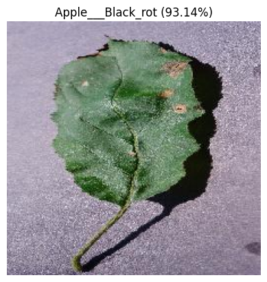
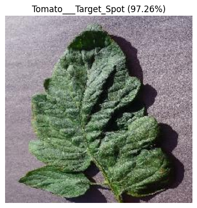
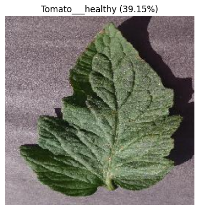
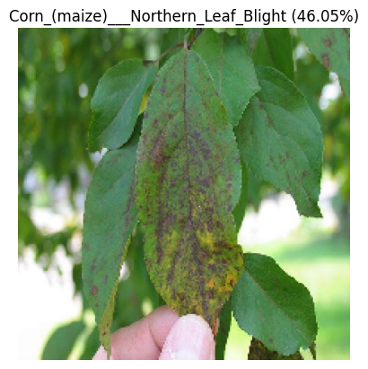
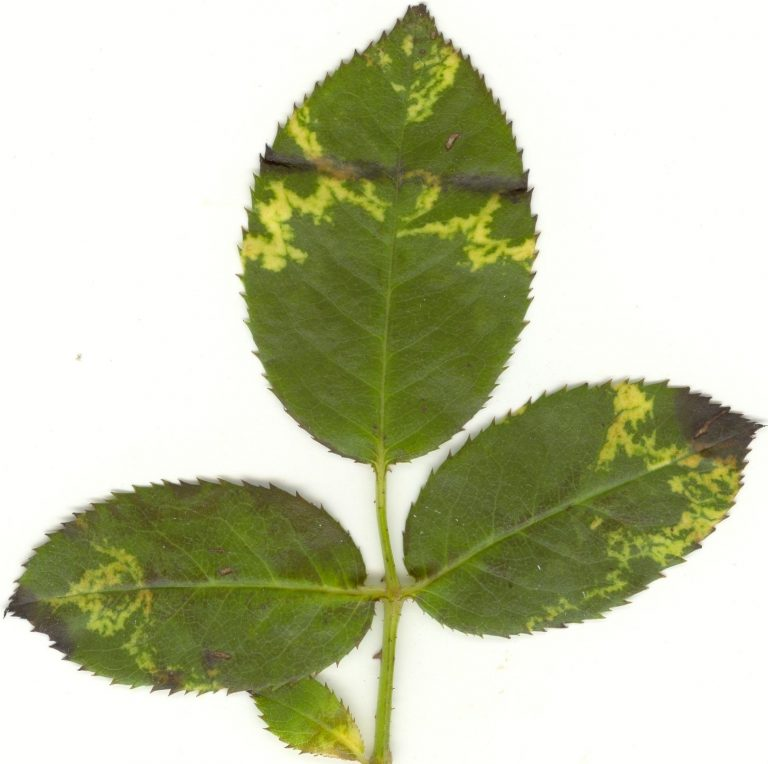
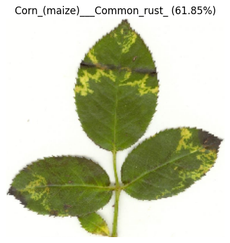

# Foundational AI Project: Plant Disease Detection

**Authors:**
* **[Tadiwos Andargie](https://github.com/TadAdane)**
* **[Daniel Manga](https://github.com/danielmenofgod)**

This project implements an **AI-based plant disease detection system** using **Transfer Learning** with the **MobileNetV2** architecture.

The goal is to automate the identification of plant diseases from leaf images, providing a fast, accurate, and scalable solution for agricultural monitoring.

The system includes:
- **MobileNetV2-based classification model** (trained on 54,000+ images)
- **Data pipeline** with rigorous **60% Train / 20% Val / 20% Test** splitting
- **Real-time prediction demo**
- **Academic documentation** of methodology and results

## 📂 **Repository Structure**


```
Plant_Disease_Detection/
│
├── Demo/ # Demo applications
│ └── Final_Project_DEMO.ipynb # Clean notebook for live presentations
│
├── Results/ # Detection outputs
│ ├── Test_images/
│ └── detections/
│
├── src/ # Project Files
│ ├── plant_disease_model_60_20_20.keras # Model File
│ ├── kaggle.json
│ └── FoundationalAI_Project.ipynb # Main notebook: Data processing, Model training & Evaluation
│
├── images/ # Raw input images (for docs & model testing)
│
└── README.md # Project documentation (This file) 
```

---


## 🚀 **Quick Start**

This project is designed to run in **Google Colab** for free GPU access.

### **1. Run the Demo (No Training Required)**
To see the model in action immediately:
1. Open `Final_Project_DEMO.ipynb` in Google Colab.
2. Upload the `plant_disease_model_60_20_20.keras` file to the Colab session.
3. Run the cells to load the model.
4. Upload any leaf image from the internet to get an instant prediction.

### **2. Re-Train the Model**
If you want to replicate the training process:
1. Open `FoundationalAI_Project.ipynb` in Google Colab.
2. Ensure you have your `kaggle.json` API token ready.
3. Run the notebook from top to bottom. It will:
   - Download the **PlantVillage** dataset.
   - Split the data (60% Train / 20% Val / 20% Test).
   - Fine-tune MobileNetV2.
   - Save the new model.


## 1. Description of the Real-World Problem

### 🎯 Goal
The goal of this project is to develop an Artificial Intelligence model that can identify the specific disease affecting a plant (or confirm that it is healthy) by analyzing a digital photograph of one of its leaves.

### 💡 Motivation
This project addresses a critical real-world problem in global food security, specifically relevant to the developing world. Plant diseases are responsible for major crop losses worldwide, threatening the livelihoods of millions of smallholder farmers.

Coming from **Ethiopia** and the **DR Congo**, both developing nations where the economy relies heavily on agriculture, we have seen firsthand how farmers struggle with crop diseases. Manual identification is slow, requires scarce experts, and is often too expensive for local farmers.

An automated AI model provides an immediate, accessible and low-cost solution. It empowers farmers to:
* **Detect diseases early**, allowing for rapid, targeted intervention.
* **Reduce crop loss**, securing food supplies and income.
* **Optimize pesticide use**, reducing financial costs and environmental harm.

### 📊 Input Data
The input data for this system consists of digital images of plant leaves. For this project, the model was trained on the publicly available **PlantVillage dataset**.

This dataset is ideal for a proof-of-concept as it contains over **54,000 images** covering 14 different plant species and **38 distinct classes** (different diseases and healthy states). Each image is a 256x256 pixel photo of a single leaf on a uniform background.

**Sample Data:**
Below is a sample of the dataset showing various healthy and diseased classes:


### 🤖 AI Domain & Type
* **AI Domain:** This project belongs to the subfield of **Computer Vision (CV)**, as the AI must learn to interpret and understand visual information from images.
* **Topic Type:** The task is a **multi-class classification** problem. The model must assign one correct label (the specific disease) to an input image from 38 possible categories.

---

## 2. State of the Art

To solve this problem, several diverse AI methods have been applied. Here is a brief description of three existing approaches, from traditional to cutting-edge.

### Approach 1: Classic Machine Learning (Feature Extraction + SVM)

* **How it Works:** This traditional method does not use deep learning. Instead, it relies on human-engineered features. An image processing expert manually extracts specific visual data from the leaf, such as:
    1.  **Color Features:** The average color of the diseased spots (e.g., "brownish-yellow").
    2.  **Texture Features:** A mathematical description of the leaf's surface (e.g., "rough," "bumpy," or "powdery").
    3.  **Shape Features:** The geometry of the leaf and the lesions (e.g., "small, circular spots").
    These extracted features are then fed into a classic machine learning classifier like a **Support Vector Machine (SVM)**, which learns to find a mathematical boundary separating the different classes.
* **Strengths:** It is computationally "cheap" and fast to train. It can also work well with very small datasets where deep learning would fail.
* **Weaknesses:** The entire model's performance depends on the quality of the hand-engineered features. This process is time-consuming, requires domain expertise, and is very brittle—it fails if the lighting, background, or camera angle changes.

### Approach 2: Deep Learning (Convolutional Neural Networks - CNNs)

* **How it Works:** This is the modern standard for image tasks. A CNN is a deep neural network inspired by the human visual cortex. It learns the important features *automatically* through a series of "convolution" and "pooling" layers.
    * The first layers learn to see simple features (like edges and colors).
    * Deeper layers combine these to recognize complex textures, shapes, and patterns (like "a brown spot with a yellow halo").
    The network learns directly from the raw pixels *which* features are most important for making a correct classification, eliminating the need for manual feature engineering.
* **Strengths:** Extremely high accuracy. It is highly robust to variations in the image (like position, scale, and rotation). This is the industry-standard approach.
* **Weaknesses:** It is a "black box," making it hard to interpret *why* it made a certain decision. It also requires a very large dataset (like PlantVillage) and is computationally expensive to train, often requiring a GPU.

### Approach 3: Advanced Deep Learning (Vision Transformers - ViT)

* **How it Works:** This is a cutting-edge method adapted from state-of-the-art Natural Language Processing (NLP) models. A ViT model works by first **breaking an image into a grid of small patches** (e.g., 16x16 pixels). It treats these patches like "words" in a sentence. It then uses a mechanism called "self-attention" to learn the relationships between *all* the patches at once, allowing it to understand the global context of the entire image.
* **Strengths:** Can achieve state-of-the-art accuracy, sometimes outperforming even the best CNNs. It is exceptionally good at understanding the broad, contextual relationships between different parts of an image.
* **Weaknesses:** Even more complex and "data-hungry" than CNNs. It typically requires even larger datasets and more computational power to train effectively.

## 3. Description of the Chosen Concept

### Our Chosen Method: Transfer Learning with MobileNetV2

For this project, we chose an advanced and highly efficient version of **Approach 2 (Deep Learning)**. Instead of building a new Convolutional Neural Network (CNN) from scratch, we used a powerful technique called **Transfer Learning** and a pre-trained model called **MobileNetV2**.

This approach was chosen because it solves the two biggest problems in deep learning:
1.  **Computation:** Training a CNN on 54,000 images from scratch would require an extremely powerful GPU and days of training time.
2.  **Data:** Even 54,000 images isn't enough for a model to learn all the basic concepts of vision (like "what is an edge," "what is a texture").

Transfer Learning solves this by "hiring an expert." We start with the **MobileNetV2** model, which has already been trained by Google on millions of images from the ImageNet dataset. It is already an expert at "seeing." We just need to teach it our specific task.

---

### How the Method Works

The implementation for this project has four key steps:

**1. Load the Pre-Trained "Expert"**
First, we load the MobileNetV2 model using `tensorflow.keras`. We explicitly tell it:
* `weights='imagenet'`: Load the "expert knowledge" it gained from the ImageNet dataset.
* `include_top=False`: This **chops off the original "decision-maker" layer**. The original model was trained to classify 1000 things (like "dog," "cat," "car"), which we don't need.
* `base_model.trainable = False`: This **"freezes"** all the expert's 2.2 million parameters. We do this to prevent our new, small dataset from destroying its valuable, pre-learned knowledge.

**2. Add a New "Decision-Maker" Layer**
After removing the old head, we stack our own new, untrained layers on top:
* `GlobalAveragePooling2D()`: This layer condenses the complex features from the expert into a simple list.
* `Dropout(0.2)`: A regularization layer that randomly turns off 20% of the neurons during training to prevent the model from just "memorizing" the training images (known as overfitting).
* `Dense(38, activation='softmax')`: This is our new "decision-maker." It's a single layer that takes the features and makes the final vote. It has **38 outputs**, one for each of our plant classes, and the `softmax` function turns its guess into a percentage (e.g., "95.68% Tomato___Target_Spot").

**3. Train *Only* the New Layer**
When we `model.compile()` and `model.fit()`, we are *only* training the new layers we added (our 48,678 "trainable parameters"). The 2.2 million "non-trainable parameters" from the expert are left untouched. This is efficient and is what allowed us to train the entire model in **under 15 minutes** on a free Google Colab GPU.

**4. Testing Procedure (Evaluation)**
To evaluate the model, the data was split into three distinct sets following a **60/20/20 ratio**:

* **Training Set (60%):** Used to teach the model features and patterns.
* **Validation Set (20%):** Used during training to monitor performance and prevent the model from memorizing the data (overfitting).
* **Testing Set (20%):** These images were held back completely and never seen by the model during training. The accuracy on this specific set determines the final success of the project.

The model's performance on this testing set is the true measure of its success.

---

### Results & Challenges

### Training Performance
The model was trained for 10 epochs. The graph below shows the **Training vs. Validation Accuracy** and **Loss**. The convergence of the training and validation lines indicates a well-generalized model with minimal overfitting.


* **Final Test Accuracy:** **85.09%**
* **Training Time:** ~15 minutes on NVIDIA T4 GPU (Google Colab).

### 📸 **Input vs Output Comparison**

The table below demonstrates the model's performance on unseen images.

| Input Image (Leaf) | Model Prediction & Confidence | Status |
|--------------------|-------------------------------|--------|
|  |  | ✅ Success |
|  |  | ✅ Success |
| |  | ⚠️ Low Confidence (Ambiguous) |
|  |  | ❌ Wrong Detection (Uncleaned image) |
|  |  | ❌ Wrong Detection (Unlearned Disease) |
> *Note:* 

> * The low confidence on ambiguous images demonstrates the model's ability to signal uncertainty rather than making false confident predictions.*

> * The model has low accuracy on real-world photos taken in a field with complex backgrounds.*

> * Model gives forces a wrong answer for diseases outside it's scope.*
---

* **Final Accuracy:** After 10 epochs of training, the model achieved a final **validation accuracy of 85.09%**. This is a strong result, showing the model can correctly classify 85 out of 100 new images from 38 different classes.
* **Proof of Concept:** The model was saved as `plant_disease_model_60_20_20.keras` (8.8 MB). This file can be loaded into any environment to make instant predictions without re-training. The demo notebook (`Final_Project_DEMO.ipynb`) proves this works.


* **Challenges & Limitations:**
    1.  **Ambiguity:** The model sometimes struggles with "ambiguous" images. For example, it confused one "Tomato___Target_Spot" leaf with a "Tomato___healthy" leaf, but its confidence was very low (39.15%). This highlights that some diseases look very similar to healthy leaves in their early stages.
    2.  **Dataset Bias:** The PlantVillage dataset is very "clean" (one leaf per image, plain background). Because of this, the model would likely have lower accuracy on "messy" real-world photos taken in a field with complex backgrounds, shadows, and multiple leaves.
    3.  **Scope:** The model only knows its 38 classes. If shown a picture of a rose bush, it would *force* a wrong answer from the 38 classes it knows.

## 📜 **License**
This project is licensed under the **MIT License** — free to use, modify, and distribute.

##  **Project Status**
✅ **Completed Prototype**
1.  Data pipeline with automatic Kaggle download & splitting.
2.  MobileNetV2 model architecture implemented.
3.  Training and validation loops successful.
4.  Real-time demo notebook working.